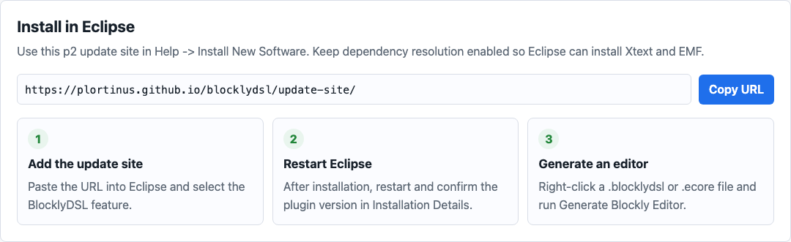

# User Guide

The basic Model2Blockly workflow is to install the Eclipse plugin, select an
annotated Ecore metamodel, generate a Blockly editor and open the generated
result in a browser.

## Recommended path

1. Install Model2Blockly from the Eclipse update site.
2. Generate the AppMaker editor from annotated `.ecore`.
3. Open the generated editor and load the sample model.
4. Check the generation report, intermediate `EditorSpec` XMI and validation
   workspace.
5. Run `npm run verify:domain-xmi` from the repository
   root to check that the generated sample domain XMI can be loaded and
   validated by EMF against `app_maker.ecore`.

## What to open first

| Goal | Page |
| --- | --- |
| Install the plugin and generate the first editor | [Getting started](../../GETTING_STARTED.md) |
| See the full AppMaker example | [AppMaker example](../../RUNNING_EXAMPLE.md) |
| Fix an installation or generation problem | [Troubleshooting](../../TROUBLESHOOTING.md) |
| Understand the Ecore-first MDE workflow | [Architecture](ARCHITECTURE.md) |

## Generated result

The generated AppMaker editor is the user-facing block DSL: toolbox, workspace,
preview panel, sample loading and XMI export.

The validation workspace is a separate generated page for checking rules as
Blockly blocks.

## Related Technical Topics

- [Architecture and implementation](ARCHITECTURE.md): generation flow,
  intermediate `EditorSpec` model, XMI reload, generator modules and output
  artifacts.
- [Project overview](../../README.md): plugin goals, input routes and common
  files.
