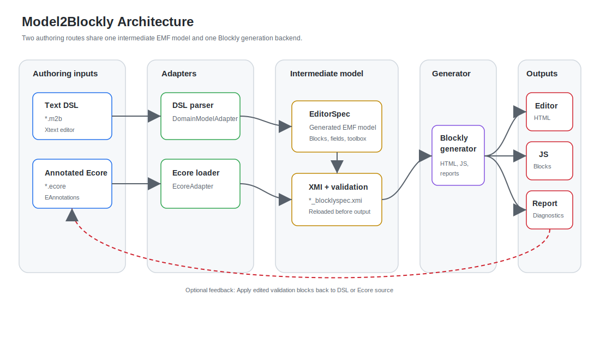
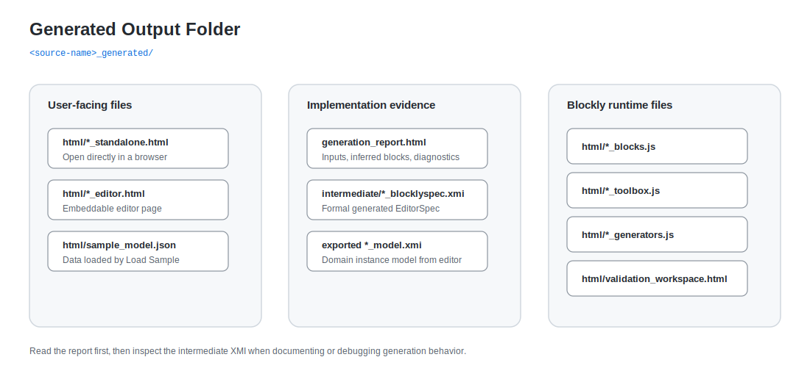

# Arquitectura e implementación

Model2Blockly está organizado como una tubería de ingeniería dirigida por
modelos. La ruta principal empieza en un metamodelo Ecore anotado, transforma
el `EPackage` cargado por EMF en un modelo EMF generado `EditorSpec`, persiste
ese modelo intermedio como XMI y genera el editor Blockly desde el modelo
recargado.

## Alineación con EMF/MDE

El proyecto sigue el patrón básico de la
[documentación de EMF](https://eclipse.dev/emf/docs.html): los metamodelos se
definen como modelos Ecore, los metamodelos usados por el generador tienen
`.genmodel` y API Java generada, las instancias se serializan como XMI y la
generación se realiza desde modelos, no mediante concatenación ad hoc de texto.

La cadena central de Model2Blockly es:

```text
metamodelo Ecore anotado (.ecore)
  -> EMF ResourceSet / EPackage
  -> transformación modelo a modelo
  -> modelo EMF generado EditorSpec
  -> intermediate/*_blocklyspec.xmi
  -> recarga y validación del XMI
  -> generación modelo a texto
  -> editor Blockly HTML/JavaScript
  -> modelo de dominio creado por el usuario JSON/XMI
```

Los metamodelos internos se mantienen como artefactos EMF:

```text
io.github.plortinus.model2blockly/model/metamodel/Model2Blockly.ecore
io.github.plortinus.model2blockly/model/metamodel/Model2Blockly.genmodel
io.github.plortinus.model2blockly/model/blockly_editor_spec.ecore
io.github.plortinus.model2blockly/model/metamodel/BlocklyEditorSpec.genmodel
io.github.plortinus.model2blockly/emf-gen/
```

El DSL textual usa Xtext como sintaxis concreta sobre la sintaxis abstracta fija
de `Model2Blockly.ecore`. La generación de Xtext escribe parser, servicios y
código IDE en `src-gen`; las API EMF generadas para los metamodelos fijos viven
en `emf-gen`, para que no se borren al regenerar la infraestructura del DSL.

La ruta Ecore también puede operar dinámicamente sobre un `.ecore` de entrada,
sin exigir generación de código Java para ese dominio. El `EPackage` de dominio
se carga con EMF y se usa como modelo fuente de la transformación.

## Arquitectura del sistema

Model2Blockly se documenta como una ruta MDE: Ecore anotado se carga como
`EPackage`, se transforma en el modelo generado `EditorSpec` y se entrega al
backend de generación antes de escribir HTML y JavaScript.



## Flujo de generación

El generador escribe un XMI intermedio y lo vuelve a leer antes de generar HTML
y JavaScript. Ese paso deja un modelo formal generado que se puede revisar,
reproducir y depurar.


## Artefactos generados

La carpeta generada separa archivos para usuarios, archivos de ejecución y
archivos útiles para explicar o depurar el sistema.



## Límite entre núcleo y extensiones

La contribución central es la tubería de metamodelo a editor Blockly:

- entrada Ecore anotada;
- modelo intermedio EMF generado `EditorSpec`;
- serialización, recarga y validación del XMI intermedio;
- generación de bloques, toolbox y editor Blockly;
- un caso de estudio representativo, AppMaker.

Las siguientes funciones son extensiones útiles, pero no el centro
arquitectónico del proyecto:

- exportación de código desde modelos de usuario;
- workspace visual de reglas de validación;
- empaquetado como update site de Eclipse;
- vista previa específica de AppMaker en el navegador.

## Mapa de implementación

| Responsabilidad | Implementación principal |
| --- | --- |
| Conversión Ecore a `EditorSpec` | [`EcoreAdapter.java`](../../io.github.plortinus.model2blockly/src/io/github/plortinus/model2blockly/adapter/EcoreAdapter.java) |
| XMI intermedio | [`BlocklySpecXmiSerializer.java`](../../io.github.plortinus.model2blockly/src/io/github/plortinus/model2blockly/intermediate/BlocklySpecXmiSerializer.java) |
| Validación intermedia | [`BlocklyEditorSpecValidator.java`](../../io.github.plortinus.model2blockly/src/io/github/plortinus/model2blockly/blocklyspec/BlocklyEditorSpecValidator.java) |
| Salida Blockly | [`BlocklyCodeGenerator.xtend`](../../io.github.plortinus.model2blockly/src/io/github/plortinus/model2blockly/generator/BlocklyCodeGenerator.xtend) |
| Orquestación de generación | [`Model2BlocklyGenerator.xtend`](../../io.github.plortinus.model2blockly/src/io/github/plortinus/model2blockly/generator/Model2BlocklyGenerator.xtend) |
| Carga y validación EMF del XMI de dominio exportado | [`verify-domain-xmi.mjs`](../../scripts/verify-domain-xmi.mjs) |

## Notas de implementación

- El editor generado es dirigido por modelos: los bloques Blockly se derivan
  del modelo fuente y no se escriben a mano.
- El XMI intermedio no es un volcado de depuración; se recarga y valida antes
  de generar la salida final.
- El editor AppMaker generado desde Ecore exporta un XMI de dominio de ejemplo
  que se comprueba con `npm run verify:domain-xmi`: el script carga
  `app_maker.ecore`, registra su `EPackage` dinámico, lee el XMI exportado con
  EMF y ejecuta `Diagnostician`.
- El caso AppMaker muestra anotaciones Ecore, XMI intermedio, JavaScript
  generado, capturas, informe de generación y workspace de validaciones en un
  solo lugar.
