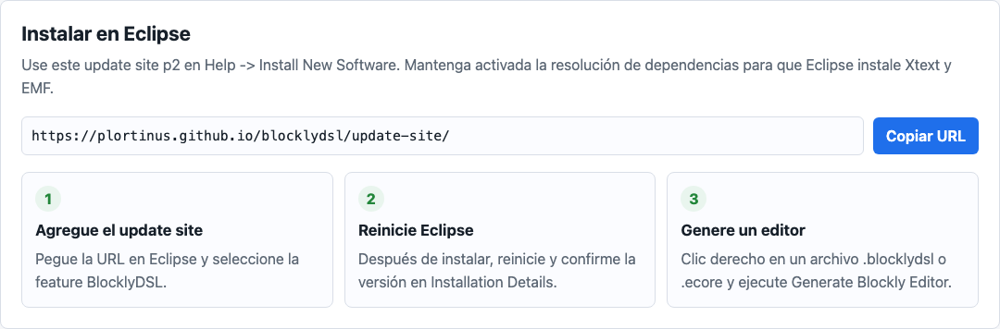
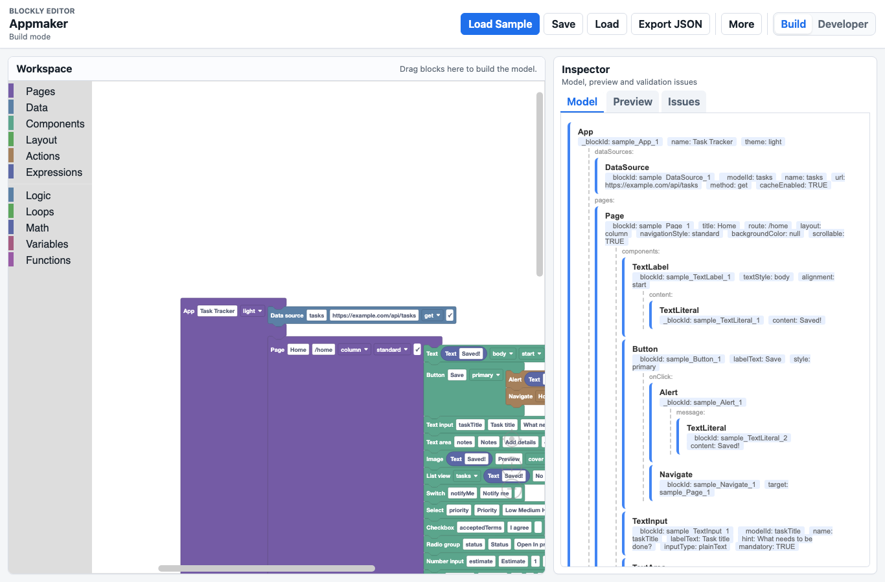
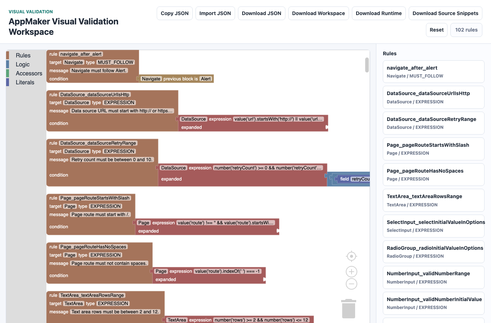

# Guía de uso

El flujo básico de Model2Blockly es instalar el plugin de Eclipse, seleccionar
un metamodelo Ecore anotado, generar un editor Blockly y abrir el resultado en
el navegador.

## Ruta recomendada

1. Instale Model2Blockly desde el update site de Eclipse.
2. Genere el editor AppMaker desde `.ecore` anotado.
3. Abra el editor generado y cargue el modelo de ejemplo.
4. Revise el informe, el XMI intermedio `EditorSpec` y el workspace de
   validaciones.
5. Ejecute `npm run verify:domain-xmi` desde la raíz del
   repositorio para comprobar que el XMI de dominio de ejemplo se carga y
   valida con EMF contra `app_maker.ecore`.

## Primeras páginas

| Necesidad | Página |
| --- | --- |
| Instalar el plugin y generar el primer editor | [Guía rápida](GETTING_STARTED.md) |
| Ver el caso AppMaker | [Caso AppMaker](RUNNING_EXAMPLE.md) |
| Resolver un problema de instalación o generación | [Solución de problemas](TROUBLESHOOTING.md) |
| Entender el flujo MDE centrado en Ecore | [Arquitectura](ARCHITECTURE.md) |

El editor AppMaker generado es la DSL de bloques orientada al usuario: toolbox,
workspace, vista previa, carga del ejemplo y exportación XMI.

## Temas técnicos relacionados

- [Arquitectura e implementación](ARCHITECTURE.md): flujo de generación,
  modelo intermedio `EditorSpec`, recarga de XMI, módulos del generador y
  artefactos de salida.
- [Vista general](PROJECT.md): objetivos del plugin, rutas de entrada y
  archivos comunes.
