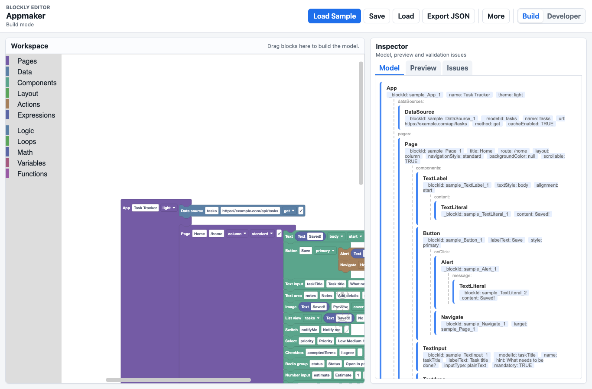
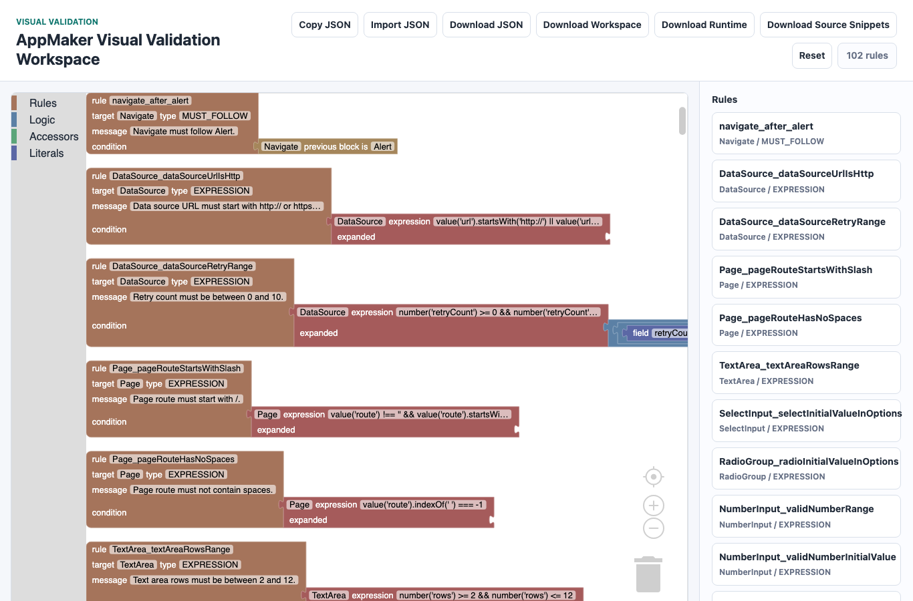

# Guía de uso

Model2Blockly puede generar desde metamodelos `.ecore` anotados o desde
modelos textuales `.m2b`. La extensión larga `.model2blockly` se mantiene como
alias de compatibilidad.

## Instalar el complemento

Consulta la [guía de instalación](./INSTALL.md). La URL p2 es:

```text
https://plortinus.github.io/model2blockly/update-site/
```

El complemento aporta:

- editor Xtext para `.m2b` y `.model2blockly`;
- comando `Generate Blockly Editor`;
- comando `Apply Validation Blocks to Source`;
- soporte de menú contextual para `.ecore`, `.m2b` y `.model2blockly`.

## Elegir una ruta de entrada

| Entrada | Cuándo utilizarla | Adaptador |
| --- | --- | --- |
| `.ecore` | Ya existe un metamodelo EMF o son importantes la herencia, los opuestos y las restricciones Ecore. | `EcoreAdapter` |
| `.m2b` | Se prefiere una definición textual compacta de bloques, categorías, campos, referencias, validaciones y plantillas. | `DomainModelAdapter` |
| `.model2blockly` | Un proyecto existente todavía utiliza la extensión heredada. Su lenguaje es el mismo que el de `.m2b`. | `DomainModelAdapter` |

Las dos rutas recomendadas producen el mismo contrato EMF `EditorSpec` antes
de generar. Ninguna evita el modelo intermedio.

## Generar en Eclipse

1. Importa o abre un proyecto que contenga una fuente `.ecore` o `.m2b`.
2. Selecciona la fuente en Project Explorer.
3. Haz clic derecho y elige `Generate Blockly Editor`.
4. Espera a que se actualice el directorio de salida.
5. Abre `generation_report.html` y después `html/*_standalone.html`.

Los puntos de entrada Java equivalentes son:

```text
standalone/EcoreToBlocklyMain.java
standalone/Model2BlocklyToBlocklyMain.java
```

AppMaker proporciona ejemplos versionados de ambas rutas:

| Ruta | Fuente | Salida generada |
| --- | --- | --- |
| Ecore | `io.github.plortinus.model2blockly/model/app_maker.ecore` | `examples/generated/app_maker_ecore` |
| `.m2b` | `examples/app_maker.m2b` | `examples/generated/app_maker_dsl` |

Todas las rutas de esta tabla son relativas a la raíz del repositorio.

## Carpeta generada

Las salidas AppMaker versionadas están en:

```text
examples/generated/app_maker_ecore
examples/generated/app_maker_dsl
```

| Ruta | Propósito |
| --- | --- |
| `generation_report.html` | Traza legible desde la fuente seleccionada hasta la salida Blockly. |
| `README.md` | Guía corta de la carpeta generada. |
| `intermediate/Appmaker_blocklyspec.xmi` | Modelo EMF `EditorSpec` serializado. |
| `html/Appmaker_standalone.html` | Editor autocontenido para navegador. |
| `html/Appmaker_editor.html` | Página del editor que carga los assets generados. |
| `html/Appmaker_blocks.js` | Definiciones Blockly. |
| `html/Appmaker_toolbox.js` | Paleta y categorías. |
| `html/Appmaker_generators.js` | Exportación de código desde plantillas. |
| `html/Appmaker_validations.js` | Validaciones en tiempo de ejecución. |
| `html/validation_workspace.html` | Espacio de trabajo visual para reglas de validación. |
| `html/validation_blocks.json` | Modelo de bloques de validación. |
| `html/validation_runtime.js` | Entorno de ejecución de la validación. |
| `html/sample_model.json` | Modelo cargado por `Load Sample`. |

## Usar el editor generado

Abre cualquiera de los dos editores versionados:

```text
examples/generated/app_maker_ecore/html/Appmaker_standalone.html
examples/generated/app_maker_dsl/html/Appmaker_standalone.html
```

Después:

1. Pulsa `Load Sample`.
2. Inspecciona los bloques.
3. Edita el modelo.
4. Exporta JSON, XML, XMI de dominio o código.
5. Abre `validation_workspace.html` para ver las reglas como bloques Blockly.





## Verificar la salida

Desde la raíz del repositorio:

```bash
npm run smoke
npm run verify:domain-xmi
npm run verify:plugin
```

| Comando | Qué valida |
| --- | --- |
| `npm run smoke` | Abre el editor AppMaker con Playwright, carga el ejemplo y comprueba el navegador. |
| `npm run verify:domain-xmi` | Carga el XMI de dominio con EMF contra `app_maker.ecore`. |
| `npm run verify:plugin` | Comprueba metadatos del complemento y la salida generada. |

## Continuar la edición

Si el resultado no corresponde al editor deseado, modifica la fuente elegida y
genera de nuevo. En Ecore se pueden ajustar clases, atributos, referencias,
cardinalidades o anotaciones `blockly`, `ui`, `validation` y `code`. En `.m2b`
se pueden ajustar declaraciones `category`, `class`, `attribute`, `contains`,
`reference`, `value`, `validation` o plantillas de código.

Consulta el [mapeo Ecore](./ECORE_TO_BLOCKLY_MAPPING.md) para la ruta de
metamodelos y la [guía del DSL textual](./TEXTUAL_DSL.md) para `.m2b`.
