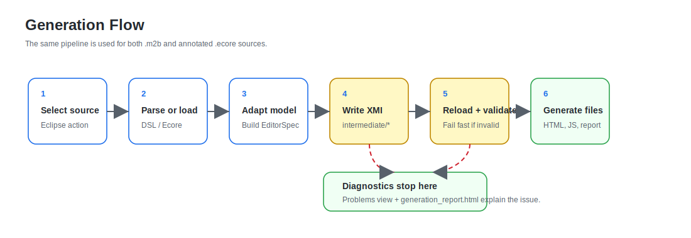

# 架构

Model2Blockly 是一个 MDE 工具链：它不手写 Blockly 编辑器，而是从模型定义出发，
经过模型转换和代码生成，自动得到一个可运行的 Blockly 编辑器。

这个生成出来的 Blockly 编辑器面向领域用户：用户通过拖拽区块创建领域模型，
而不需要手写底层模型文件。在论文或架构语境中，可以说明它是基于 Blockly 的
图形化建模界面；在用户文档中直接称为 Blockly 编辑器更清楚。

当前项目应理解为双输入架构：

- **Ecore route**：从带注解的 `.ecore` 元模型生成 Blockly 编辑器。
- **DSL route**：从 Model2Blockly 文本 DSL，也就是 `.m2b` 文件，生成 Blockly 编辑器。

两条路线都会转换到同一个 EMF 中间模型 `EditorSpec`，再由 Xtend 生成 HTML、
JavaScript、工具箱、验证逻辑和示例模型。

## 总体链路

```text
Annotated Ecore metamodel             Model2Blockly textual DSL
(.ecore)                              (.m2b)
        |                                  |
        v                                  v
EMF ResourceSet / EPackage          Xtext parser / DomainModel
        |                                  |
        v                                  v
EcoreAdapter                         DomainModelAdapter
        \                                  /
         \                                /
          v                              v
           EditorSpec EMF intermediate model
                         |
                         v
          intermediate/*_blocklyspec.xmi
                         |
                         v
              XMI reload + diagnostics
                         |
                         v
              BlocklyCodeGenerator.xtend
                         |
                         v
      HTML + JS + toolbox + validations + sample model
```



## MDE 组成

| MDE 元素 | 项目中的对应物 |
| --- | --- |
| 源元模型 | AppMaker 等领域 `.ecore` 元模型。 |
| 文本 DSL 元模型 | `model/metamodel/Model2Blockly.ecore`。 |
| 文本语法 | `Model2Blockly.xtext`，文件扩展名推荐使用 `.m2b`。 |
| 中间元模型 | `model/blockly_editor_spec.ecore`。 |
| 中间模型实例 | `intermediate/*_blocklyspec.xmi`。 |
| 模型转换 | `EcoreAdapter` 和 `DomainModelAdapter`。 |
| 代码生成 | `BlocklyCodeGenerator.xtend`。 |
| 生成工具 | 给领域用户使用的 Blockly standalone editor、工具箱、验证脚本和示例模型。 |

这里的关键点是：`EditorSpec` 不是一个临时 Java 数据结构的替代说法。项目中确实有
手写 Java helper objects，便于实现和测试；但生成契约会映射到
`blockly_editor_spec.ecore` 定义的 EMF 模型，并序列化为 XMI。

## 入口

| 使用场景 | 入口代码 | 输入 | 说明 |
| --- | --- | --- | --- |
| Eclipse 右键生成 | `io.github.plortinus.model2blockly.ui/handlers/GenerateBlocklyEditorHandler.java` | `.ecore`, `.m2b`, `.model2blockly` | 插件命令入口。`.m2b` 是推荐的文本 DSL 扩展名，`.model2blockly` 是兼容保留的旧扩展名。 |
| standalone Ecore 生成 | `standalone/EcoreToBlocklyMain.java` | `.ecore` | 直接读取 Ecore `EPackage`，适合已有 EMF 元模型。 |
| standalone DSL 生成 | `standalone/Model2BlocklyToBlocklyMain.java` | `.m2b` | 使用 Xtext 解析 `DomainModel`，适合用简洁文本定义 Blockly 语言。 |
| Xtext 增量生成器 | `generator/Model2BlocklyGenerator.xtend` | `.m2b` | Eclipse/Xtext builder 入口，最终仍进入 EditorSpec 和 Blockly 生成器。 |
| 验证规则回写 | `ValidationPatchMain.java` / `ApplyValidationPatchHandler.java` | `validation_blocks.edited.json` | 将验证工作区编辑后的规则回写到源模型。 |

## Ecore Route

`EcoreAdapter.java` 是 Ecore route 的模型转换核心。它把 `EPackage` 分析成
`BlocklyEditorSpec`，再映射成 EMF `EditorSpec`。

主要步骤：

1. 读取 `EPackage` 的名称、`nsURI`、`nsPrefix`。
2. 读取包级注解：`source="blockly"` 的 workspace 配置、`source="code"` 的代码导出配置、`source="runtime"` 的运行时配置。
3. 收集所有 classifier，包括子 `EPackage` 里的 classifier。
4. 遍历每个 `EClass`，生成 `BlockTypeSpec`。
5. 按声明顺序处理 `EAttribute` 和 `EReference`，生成字段、statement input、value input 或引用字段。
6. 根据 containment、继承和 output 注解决定连接类型。
7. 生成必填、基数、唯一性、`mustFollow`、expression/condition/js 和部分 OCL 验证规则。

默认推断和注解定制的完整规则见
[Ecore 到 Blockly 映射规则](./ECORE_TO_BLOCKLY_MAPPING.md)。

## DSL Route

Model2Blockly 文本 DSL 使用 `.m2b` 文件。它不是终端用户用来创建某个 App 实例的
业务 DSL，也不是最终的 Blockly 编辑器；它是一个 **language-definition DSL**。
语言设计者或工具开发者用它定义一种 Blockly 语言有哪些 block、字段、连接、分类和验证。

```text
domain Appmaker

category Pages label "Pages" colour 260

class App category Pages {
  attribute name : string required
  contains Page pages [1..20]
}

class Page category Pages {
  attribute title : string required
  contains Component components [1..40]
}
```

Xtext 解析 `.m2b` 后得到 `DomainModel`，再由 `DomainModelAdapter` 转换成同一个
`EditorSpec`。因此，Ecore route 和 DSL route 的差异只在输入层；Blockly 生成层是共享的。

更完整的 DSL 说明见 [Model2Blockly 文本 DSL](./TEXTUAL_DSL.md)。

## 中间模型

EditorSpec 是项目内部的生成契约。源模型进入 EditorSpec 后，后续 HTML 生成器
不再关心输入来自 Ecore 还是 `.m2b`。

| 层 | 代码位置 | 作用 |
| --- | --- | --- |
| 手写 Java 中间对象 | `src/io/github/plortinus/model2blockly/blocklyspec` | 便于 adapter 构造和验证的实现层对象。 |
| EMF 中间模型 | `emf-gen/io/github/plortinus/model2blockly/intermediate/blocklyspec` | 由 `blockly_editor_spec.ecore` 生成的 EMF API。 |
| 两者映射 | `intermediate/BlocklySpecModelMapper.java` | 在手写对象和 EMF `EditorSpec` 之间转换。 |
| XMI 工具 | `intermediate/BlocklySpecXmiSerializer.java` | 写出 `intermediate/*_blocklyspec.xmi`，再从 XMI 读回 `EditorSpec`。 |

`EditorSpec` 保存生成 Blockly 所需的全部信息：domain 名称、`nsURI`、`nsPrefix`、
toolbox 分类、block types、验证规则、workspace 选项、代码导出语言、运行时类型等。

## HTML 生成层

`BlocklyCodeGenerator.xtend` 只依赖 EditorSpec，不直接读 Ecore 或 `.m2b`。它输出：

| 文件 | 作用 |
| --- | --- |
| `html/<Domain>_blocks.js` | Blockly block definitions。 |
| `html/<Domain>_toolbox.js` | toolbox 或 flyout 配置。 |
| `html/<Domain>_generators.js` | 从 block 生成代码或领域数据的逻辑。 |
| `html/<Domain>_validations.js` | 运行时验证逻辑。 |
| `html/<Domain>_editor.html` | 嵌入式编辑器页面。 |
| `html/<Domain>_standalone.html` | 可直接打开的完整编辑器。 |
| `html/validation_workspace.html` | 用 Blockly 查看和编辑验证规则的工作区。 |
| `html/validation_blocks.json` | 验证规则的 Blockly block model。 |
| `html/validation_runtime.js` | 验证规则运行时代码。 |
| `html/sample_model.json` | 根据 EditorSpec 生成的示例模型。 |

`GenerationReportHtmlRenderer.java` 会额外生成 `generation_report.html`，用于查看输入模型、
生成文件、源模型到 Blockly 的映射和验证规则摘要。

## AppMaker 运行时扩展

`source="runtime"` 或 `.m2b` 中的 `runtimeKind "appMaker"` 可给生成编辑器附加领域运行时。
当前代码中的具体实现是：

| 文件 | 作用 |
| --- | --- |
| `AppMakerHtmlRuntimeGenerator.java` | 当 runtime kind 为 `appMaker` 或 domain 名称为 `AppMaker/Appmaker` 时，为 standalone 编辑器加入 AppMaker Preview tab。 |

这个运行时只服务 AppMaker 案例，不改变通用的模型转换和 Blockly 生成链路。

## 目录结构

| 目录 | 内容 |
| --- | --- |
| `io.github.plortinus.model2blockly/src` | 手写核心逻辑：adapter、中间模型映射、生成器、standalone 入口、验证回写。 |
| `io.github.plortinus.model2blockly/src-gen` | Xtext 生成的解析器、语法访问、基础验证代码。 |
| `io.github.plortinus.model2blockly/emf-gen` | EMF 生成的 Java API，包括 DSL 模型和 EditorSpec 中间模型。 |
| `io.github.plortinus.model2blockly/xtend-gen` | Xtend 编译后的 Java。 |
| `io.github.plortinus.model2blockly.ui` | Eclipse UI handler、popup action 和验证回写命令。 |
| `io.github.plortinus.model2blockly.feature` | Eclipse feature 打包。 |
| `io.github.plortinus.model2blockly.updatesite` | p2 update site 发布目录。 |
| `docs` | VitePress 文档源和文档资源。 |
| `scripts` | 文档构建、示例生成、update-site 处理和验证脚本。 |

## 构建和发布

本仓库的 GitHub Pages workflow 位于 `.github/workflows/pages.yml`。发布时会：

1. 运行 `npm run build:site-docs` 构建 VitePress 文档。
2. 将 AppMaker Ecore route 生成编辑器复制到 `_site/app_maker_ecore/`，将
   DSL route 生成编辑器复制到 `_site/app_maker_dsl/`。
3. 将 Eclipse p2 repository 复制到 `_site/update-site/`。
4. 上传 `_site` 到 GitHub Pages。

线上路径：

| 路径 | 作用 |
| --- | --- |
| `/model2blockly/` | VitePress 文档首页。 |
| `/model2blockly/app_maker_ecore/` | AppMaker Ecore route 生成编辑器演示。 |
| `/model2blockly/app_maker_dsl/` | AppMaker DSL route 生成编辑器演示。 |
| `/model2blockly/update-site/` | Eclipse 插件安装用 p2 endpoint。 |

## 验证脚本

| 命令 | 检查内容 |
| --- | --- |
| `npm run verify:docs` | 构建 VitePress 文档，检查页面、链接、资源和示例画廊。 |
| `npm run build:doc-examples` | 重新生成文档中的最小 Ecore 功能示例。 |
| `npm run smoke` | 用 Playwright 打开生成的 standalone 编辑器，执行基础浏览器 smoke test。 |
| `npm run verify:domain-xmi` | 检查 AppMaker 导出的 domain XMI 是否能被 EMF 读取和诊断。 |
| `npm run verify:plugin` | 检查 Eclipse 插件/update-site 产物。 |
| `npm run verify:patch` | 检查验证规则回写流程。 |

## 边界

论文和文档应避免把项目写成单纯的 “Ecore 生成 Blockly”。更准确的表述是：

- Model2Blockly 是一个双输入 MDE 工具链。
- Ecore route 适合已有 EMF 元模型和 Ecore 注解。
- `.m2b` DSL route 适合语言设计者用简洁文本定义 block-based language。
- 两条路线都会做模型转换，目标都是 EMF `EditorSpec` 中间模型。
- 最终生成物在用户文档中称为 Blockly 编辑器；在论文语境中可以解释为基于 Blockly 的图形化建模界面。
- 不要把 `.m2b` 文本 DSL 输入和最终生成的 Blockly 编辑器混在一起。
