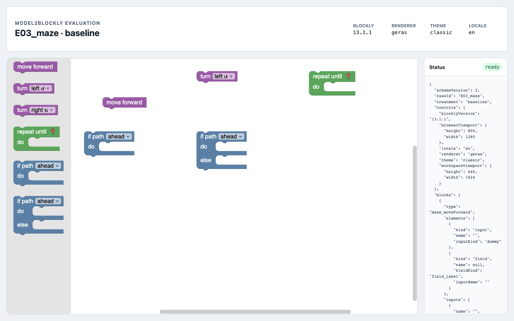
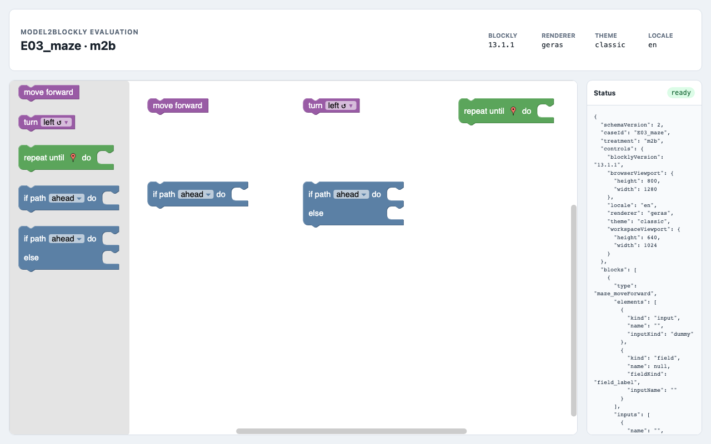
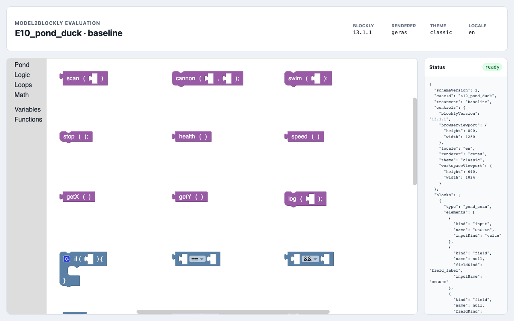
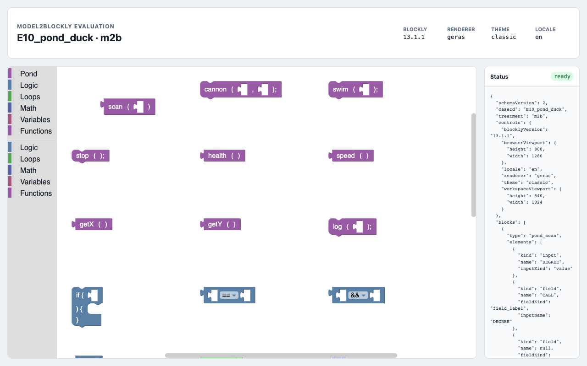

# 使用现有 Blockly 编辑器进行评估

AppMaker 是项目的端到端集成案例，用来展示 Ecore 和 `.m2b` 两条输入路线如何生成
可运行的编辑器。外部评估使用另一组证据：把 Model2Blockly 与 Blockly 官方仓库中的
10个编辑器配置进行比较，测量编辑器功能的复现程度和维护源文件规模的变化。

## 评估对象

评估单元是 **Blockly 编辑子系统**：

- 区块类型、字段、输入、连接和布局；
- 工具箱、分类、影子块和初始工作区；
- 浏览器中可观察到的编辑器行为；
- 与区块关联的代码生成器。

消费生成程序的领域运行层不在主要评估范围内。例如，Maze 的地图、Turtle 的画布、
Music 的音频和 Pond 的模拟器都被排除。Geras 渲染器属于 Blockly 内部的区块显示
方式，因此作为控制变量固定下来。

## 案例与控制条件

语料包含 Graph Demo、JS-Interpreter Wait、Maze、Bird、Movie、Music、Turtle、
Puzzle、Pond Tutor 和 Pond。官方源码固定到 `google/blockly-games` 与
`google/blockly-samples` 的具体版本提交。BASELINE 和 M2B 均使用 Blockly 13.1.1、
Geras、Classic 主题、英文区域设置，以及相同的浏览器和工作区尺寸。

等价判断不依赖截图。每种处理都会转换为规范化描述符，再按原子属性比较，状态包括
`match`、`partial`、`mismatch`、`unsupported`、`error` 和 `excluded`。截图只作为
辅助视觉证据保留。

## 汇总结果

| 指标 | 结果 |
| --- | ---: |
| 无加载错误的案例 | 10/10 |
| 编辑器结构加权复现率 | 2315/2762（83.82%） |
| 各案例复现率的均值/中位数 | 83.41% / 82.71% |
| 代码生成器加权复现率 | 227/291（78.01%） |
| 官方配置 LOC / `.m2b` LOC | 4074 / 1121 |
| LOC 加权减少比例 | 72.48% |
| 对共享官方源码去重后的保守减少比例 | 70.00% |
| Ecore–`.m2b` 严格等价 | 3/3个案例 |

10个生成编辑器都可以加载，但10个都被归类为**部分复现**。因此，83.82%不能解释为
完整应用等价。主要差异集中在连接策略、动态工具箱组合、用于排版的输入，以及需要
共享状态、变形器（mutator）或自动序列化的生成器。

LOC 减少比例只衡量需要维护的源文件是否更紧凑，不等同于开发时间、认知难度或人员
生产率的减少。这个指标必须和功能复现率一起阅读：模型明显更短，但当前版本还不能
表达官方编辑器中的全部能力。

## 各案例结果

| 案例 | 区块数 | 编辑器复现率 | 生成器复现率 | 官方 LOC | `.m2b` LOC | LOC 减少 | 分类 |
| --- | ---: | ---: | ---: | ---: | ---: | ---: | --- |
| Graph Demo | 2 | 77/91（84.62%） | 7/8（87.50%） | 329 | 28 | 91.49% | 部分复现 |
| JS-Interpreter Wait | 1 | 73/89（82.02%） | 4/4（100.00%） | 282 | 16 | 94.33% | 部分复现 |
| Maze | 5 | 111/137（81.02%） | 15/15（100.00%） | 178 | 73 | 58.99% | 部分复现 |
| Bird | 8 | 203/218（93.12%） | 27/31（87.10%） | 246 | 93 | 62.20% | 部分复现 |
| Movie | 5 | 236/283（83.39%） | 16/20（80.00%） | 449 | 75 | 83.30% | 部分复现 |
| Music | 6 | 186/232（80.17%） | 19/21（90.48%） | 545 | 94 | 82.75% | 部分复现 |
| Turtle | 12 | 349/427（81.73%） | 30/40（75.00%） | 669 | 190 | 71.60% | 部分复现 |
| Puzzle | 3 | 59/75（78.67%） | 6/12（50.00%） | 221 | 46 | 79.19% | 部分复现 |
| Pond Tutor | 11 | 340/397（85.64%） | 35/44（79.55%） | 415 | 154 | 62.89% | 部分复现 |
| Pond | 24 | 681/813（83.76%） | 68/96（70.83%） | 740 | 352 | 52.43% | 部分复现 |

## 视觉证据

下面的截图在相同浏览器控制条件下展示官方 BASELINE 和生成的 M2B 编辑器。截图用于
人工检查，不参与像素相似度计算。

### Maze

| 官方 BASELINE | 生成的 M2B |
| --- | --- |
|  |  |

### Pond

| 官方 BASELINE | 生成的 M2B |
| --- | --- |
|  |  |

## Ecore 与 `.m2b` 输入路线

Graph、Maze 和 Turtle 分别使用 Ecore 与 `.m2b` 建模。比较时要求控制项、区块、
工具箱、初始工作区、生成器、错误和可加载性七部分完全一致，最终3组全部严格等价。

这里不使用 LOC 比较 Ecore 和 `.m2b`。XML/XMI 与文本 DSL 属于不同编辑单位；对于
输入路线，更合理的问题是两个适配器是否生成相同的公共编辑器规格。

## 复现实验与查看证据

```bash
npm run verify:evaluation-completed
npm run aggregate:evaluation
```

完整证据保存在：

- [实验目录与组织方式](../../evaluation/official-blockly/README.md)
- [评估协议（西班牙语）](../../evaluation/official-blockly/protocol.md)
- [自动生成的汇总结果](../../evaluation/official-blockly/results/summary.md)
- [JSON 聚合结果](../../evaluation/official-blockly/results/aggregate.json)
- [观察到的支持边界](../../evaluation/official-blockly/support-boundaries.md)
- [案例、版本提交与控制条件](../../evaluation/official-blockly/manifest.json)
