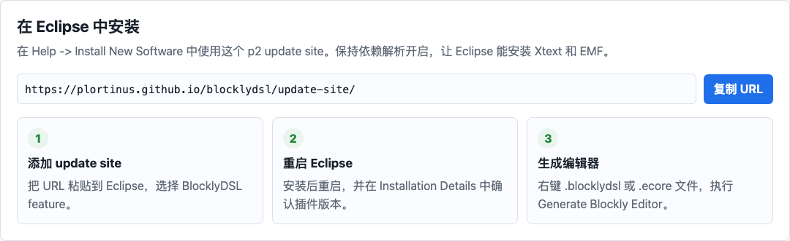

# 使用指南

使用 Model2Blockly 的基本流程是：安装 Eclipse 插件，选择带注解的 Ecore 元模型，生成 Blockly 编辑器，然后在浏览器中打开生成结果。

## 推荐路径

1. 从 Eclipse update site 安装 Model2Blockly。
2. 从带注解的 `.ecore` 生成 AppMaker 编辑器。
3. 打开生成的编辑器，加载示例模型。
4. 查看生成报告、中间 `EditorSpec` XMI 和验证工作区。
5. 在仓库根目录运行 `npm run verify:domain-xmi`，确认生成的示例领域 XMI 能被 EMF 按 `app_maker.ecore` 加载和验证。

## 先看哪些页面

| 你想做什么 | 页面 |
| --- | --- |
| 安装插件并生成第一个编辑器 | [快速开始](GETTING_STARTED.md) |
| 查看完整 AppMaker 案例 | [AppMaker 案例](RUNNING_EXAMPLE.md) |
| 解决安装或生成问题 | [排错](TROUBLESHOOTING.md) |
| 理解以 Ecore 为主线的 MDE 流程 | [架构与实现](ARCHITECTURE.md) |

## 生成结果长什么样

生成的 AppMaker 编辑器就是面向用户的块式 DSL，包含 toolbox、workspace、预览区、示例加载和 XMI 导出。

验证工作区是另一个生成页面，用 Blockly 块展示验证规则，方便检查生成器产出的约束。

## 相关技术主题

- [架构与实现](ARCHITECTURE.md)：生成流程、中间 `EditorSpec` 模型、XMI 读回、生成模块和输出产物。
- [项目概览](PROJECT.md)：插件目标、输入路线和常用文件。
