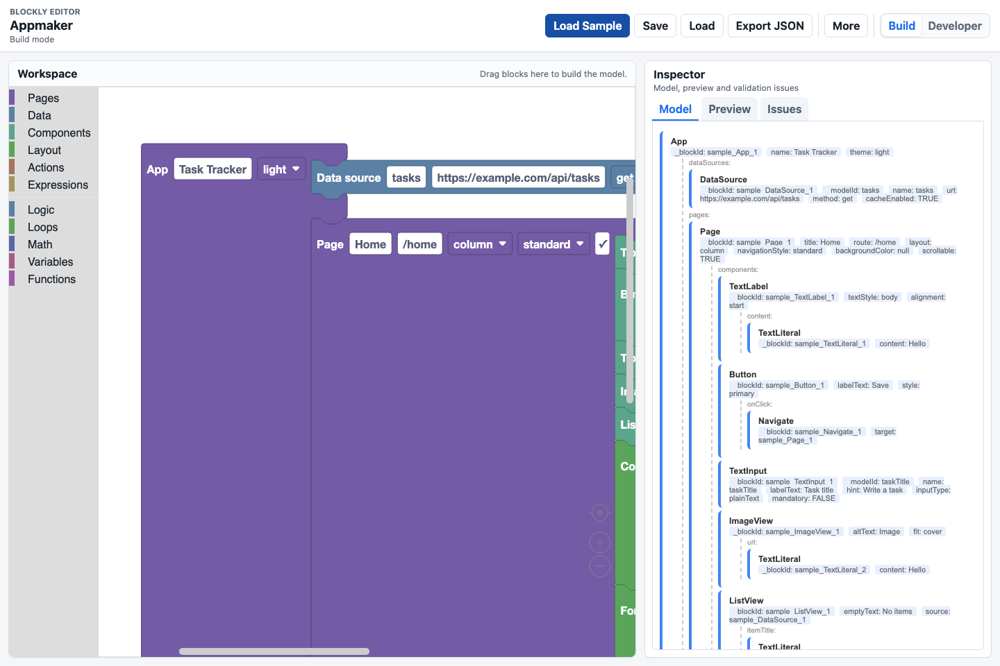
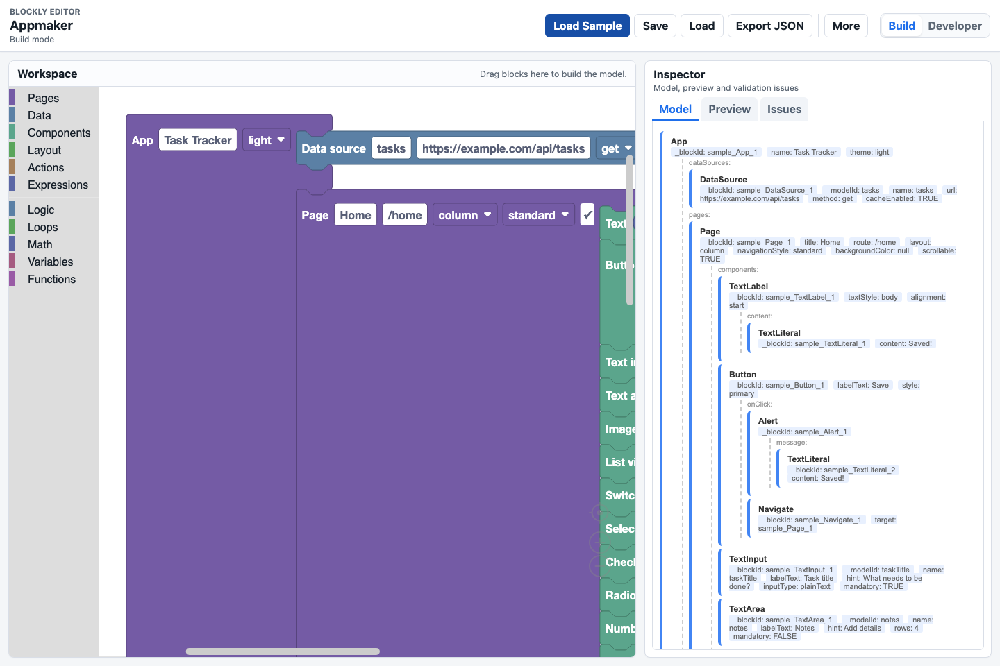
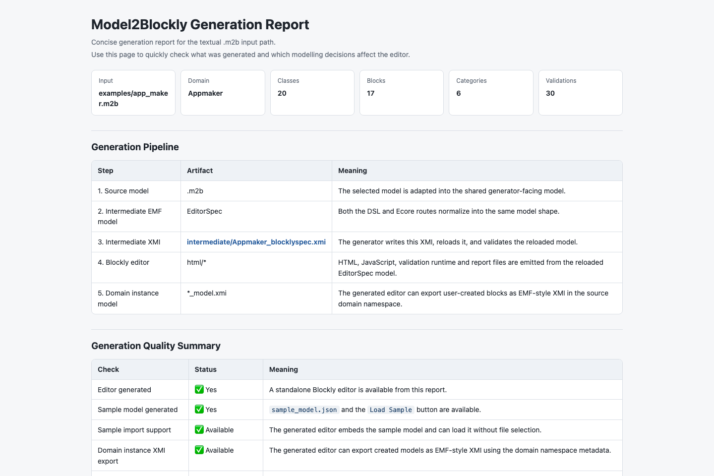
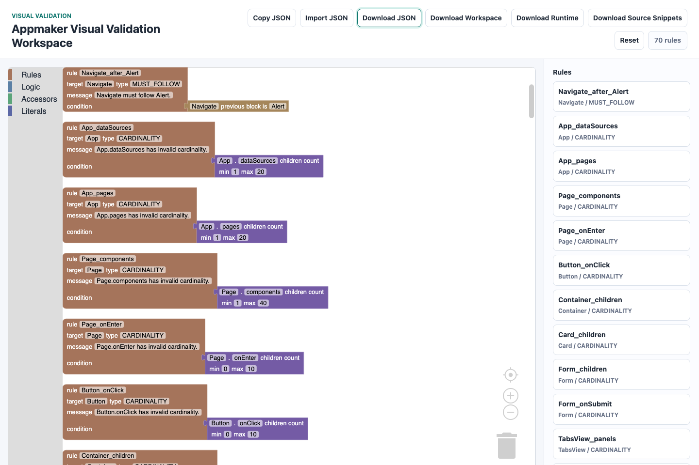

# Ejemplo conductor y evaluación

La evaluación de BlocklyDSL busca comprobar si el enfoque es viable. En concreto, se analiza si es posible generar editores Blockly reutilizables a partir de descripciones de dominio, sin programar cada editor desde cero. Para ello se usa un ejemplo conductor, verificaciones técnicas y pruebas automáticas.

No se evalúan aprendizaje ni usabilidad con usuarios finales. Ese tipo de estudio necesitaría participantes, tareas y métricas de interacción. Aquí la evaluación se centra en la ingeniería de la solución: rutas de entrada, artefactos generados, validaciones, modelo intermedio y pruebas automáticas.

## Estrategia de evaluación

La estrategia de evaluación combina tres tipos de evidencia:

1. un ejemplo conductor, AppMaker, definido con Ecore y con el DSL textual;
2. inspección y verificación sintáctica de los artefactos generados;
3. pruebas automáticas sobre modelo intermedio, adaptadores y generadores.

La memoria PDF incluye una figura que relaciona estas fuentes de evidencia. El mismo dominio se expresa mediante dos entradas distintas, `app_maker.m2b` y `app_maker.ecore`, y ambas atraviesan la misma cadena de adaptación y generación:

```text
AppMaker (DSL textual)  ─┐
                         ├─> Cadena común ─> Editores Blockly ─> Evidencia técnica
AppMaker (Ecore anotado) ┘       de              generados        informes, JS válido,
                             generación                          pruebas automáticas
```

Estas fuentes responden a tres preguntas. Primero, si las dos rutas de entrada pueden usar la misma arquitectura. Segundo, si el modelo intermedio contiene los elementos necesarios para describir un editor Blockly completo. Tercero, si los artefactos generados son técnicamente coherentes y pueden verificarse de forma repetible.

La primera fuente analiza la reutilización de la cadena generativa. Un generador de editores de bloques no resulta convincente si cada ruta exige una implementación específica. Por ello, AppMaker se describe dos veces: como DSL textual y como metamodelo Ecore con anotaciones. La comparación muestra si ambas rutas convergen en el mismo metamodelo intermedio y reutilizan los mismos generadores.

La segunda fuente comprueba que la generación produce ficheros revisables y sintácticamente válidos. En particular, los ficheros JavaScript generados para las salidas incluidas se han comprobado con `node --check`, lo que permite detectar errores de sintaxis sin ejecutar el editor completo en el navegador. Esta comprobación no sustituye a una prueba funcional interactiva, pero sí reduce el riesgo de que el generador emita código JavaScript mal formado.

La tercera fuente son las pruebas JUnit del proyecto. Estas pruebas no dependen de la interacción manual con el navegador y permiten comprobar comportamientos internos: mapeos desde Ecore, mapeos desde el DSL textual, comportamiento del modelo intermedio y generación HTML/JavaScript.

## Ejemplo conductor seleccionado

El ejemplo seleccionado es AppMaker. Representa una aplicación visual con páginas, componentes, acciones, navegación y fuentes de datos. Se ha elegido porque combina elementos estructurales y semánticos suficientes para evaluar la generación: contenciones, herencia, clases abstractas, referencias dinámicas, campos obligatorios, entradas de valor, validaciones simples y plantillas de código.

| Caso | Entrada | Rasgos evaluados |
|---|---|---|
| AppMaker | DSL textual | Dominio compacto escrito en Xtext, con categorías, clases, atributos, contenciones, referencias, validaciones, metadatos de interfaz y plantillas de código. |
| AppMaker | Ecore anotado | Metamodelo EMF con clases, atributos, referencias, enumeraciones, cardinalidades y anotaciones `blockly`, `ui`, `code` y `runtime`. |

## AppMaker por las dos rutas de entrada

AppMaker representa una aplicación visual con páginas, componentes, acciones, navegación y fuentes de datos. El resultado generado es un editor de modelado: el usuario no recibe una aplicación final cerrada, sino un entorno visual para construir modelos de aplicaciones. El dominio incluye referencias cruzadas representativas: un `ListView` referencia una fuente de datos, y una acción `Navigate` referencia una página destino. También se usan plantillas de código para generar una representación textual de la aplicación.

La ruta textual parte de `examples/app_maker.m2b`. En ese artefacto se declaran las categorías del toolbox, las clases del dominio, los atributos, las contenciones, las referencias, los metadatos de interfaz y las plantillas de código. El fichero textual es compacto y permite ver en un único lugar la estructura del dominio y la información de presentación necesaria para el editor.

La ruta Ecore parte de `model/app_maker.ecore`. En esta variante, la estructura del dominio se expresa como metamodelo EMF y la información específica de Blockly se añade mediante anotaciones. Las anotaciones con fuente `blockly` controlan aspectos de sintaxis visual, las anotaciones `ui` describen metadatos de interfaz, las anotaciones `code` definen plantillas de generación y las anotaciones `runtime` seleccionan opciones de ejecución.

Ambas rutas producen una instancia del modelo intermedio `EditorSpec`. Esta instancia se serializa como XMI dentro de la carpeta `intermediate/` de cada salida generada, tanto en la ruta DSL como en la ruta Ecore. A partir de ese modelo se generan los artefactos HTML/JavaScript, las validaciones, las páginas de edición y el informe de generación.

Las capturas generadas para la memoria muestran las dos rutas de entrada y los artefactos de evidencia:









## Cobertura funcional

| Capacidad | Evidencia en AppMaker |
|---|---|
| Ruta Ecore | `model/app_maker.ecore` con anotaciones. |
| Ruta textual del DSL | `examples/app_maker.m2b`. |
| Contención y cardinalidad | `App` contiene páginas, `Page` contiene componentes y algunas relaciones tienen límites mínimos y máximos. |
| Herencia y clases abstractas | `Component`, `Action` y `TextExpression` son conceptos abstractos con subtipos concretos. |
| Referencias dinámicas | `ListView.source`, `Navigate.target`, `SubmitForm.endpoint` y `SetInputValue.input` se generan como desplegables dinámicos. |
| Entradas de valor y bloques de salida | `Alert.message`, `ListView.itemTitle`, `ImageView.url` y `SetInputValue.newValue` reciben `TextExpression`; `TextLiteral`, `InputValue`, `DataField` y `JoinText` se generan como bloques de salida. |
| Shadow blocks | Las entradas de valor usan `TextLiteral` como bloque sombra por defecto. |
| Validaciones de orden | La regla `navigate_after_alert` comprueba una restricción local de secuencia. |
| Campos avanzados | El dominio incluye enumeraciones, booleanos, valores por defecto y campos obligatorios. |
| Plantillas de código | Las clases principales incluyen plantillas para producir una representación JavaScript del modelo. |
| Metadatos de interfaz | Las dos rutas incluyen etiquetas, grupos, orden, widgets de campo y campos de referencia para personalizar la salida HTML. |

La cobertura muestra que AppMaker no es solo una demostración visual. El ejemplo ejercita las dos rutas de entrada, el metamodelo intermedio, la generación HTML/JavaScript, las referencias, las validaciones y las plantillas de código. Esto apoya la idea de que BlocklyDSL es una cadena generativa reutilizable, aunque una evaluación más amplia con otros metamodelos queda como trabajo futuro.

## Verificaciones técnicas

Además del ejemplo conductor, se han realizado verificaciones técnicas sobre los artefactos generados y sobre el código del proyecto. La primera verificación consiste en comprobar que los ficheros JavaScript generados no contienen errores de sintaxis. Para ello se ha usado una comprobación sintáctica de Node.js sobre la salida generada. No se detectaron errores de sintaxis en los ficheros revisados, lo que aporta una comprobación reproducible sobre la corrección sintáctica de la salida JavaScript.

La segunda verificación es la existencia de pruebas JUnit por capa. El proyecto incluye 142 pruebas distribuidas de la siguiente forma:

| Capa probada | Número | Cobertura principal |
|---|---:|---|
| Modelo intermedio | 26 | Tipos, valores por defecto y conexiones. |
| Adaptador Ecore | 39 | Conversión desde Ecore, anotaciones, referencias, conexiones y validaciones. |
| Adaptador del DSL textual | 5 | Conversión desde el DSL textual, campos obligatorios, referencias y metadatos de código. |
| Generador HTML/JavaScript | 60 | Generación HTML/JavaScript, bloques, toolbox, validaciones, referencias y exportación. |

La organización de las pruebas sigue la misma división que la arquitectura. Si falla una prueba del adaptador Ecore, el problema está en la ruta de entrada. Si falla una prueba del generador HTML/JavaScript, el problema está en la salida. Si falla una prueba del modelo intermedio, puede haberse roto el contrato común entre capas.

## Resultados frente a los objetivos

| Objetivo | Evidencia aportada |
|---|---|
| OE1 | AppMaker ejercita bloques, campos, categorías, conexiones, referencias, validaciones y exportación. |
| OE2 | AppMaker se genera desde un metamodelo Ecore anotado. |
| OE3 | AppMaker también se define con el DSL textual. |
| OE4 | Ambas rutas pasan por el modelo intermedio común, lo que permite reutilizar generadores. |
| OE5 | Cada ruta produce editores HTML/JavaScript con bloques, toolbox, validaciones y páginas de edición. |
| OE6 | El ejemplo incluye referencias dinámicas, validaciones, personalización de interfaz y plantillas de código. |
| OE7 | La solución se contrasta con AppMaker por dos rutas y con 142 pruebas automáticas organizadas por capa. |

La evaluación respalda la idea central del trabajo dentro del alcance definido: es viable generar editores Blockly desde metamodelos o desde un DSL textual, y mantener una arquitectura común. La evidencia principal es que un mismo dominio se procesa con dos rutas de entrada, una misma representación intermedia y los mismos generadores.

## Limitaciones de la evaluación

La evaluación realizada tiene límites. En primer lugar, AppMaker ha sido diseñado dentro del proyecto. Aunque cubre estructuras variadas, no equivale a una evaluación con usuarios externos ni con modelos industriales de gran tamaño. En segundo lugar, las comprobaciones generadas se implementan como advertencias y confirmaciones de exportación, no como un mecanismo formal de verificación semántica completa. En tercer lugar, la comprobación sintáctica de JavaScript no verifica interacción visual en todos los navegadores.

Además, la ruta Ecore se ha evaluado con un metamodelo representativo, pero no con un conjunto amplio de metamodelos heterogéneos. Funciones como la sincronización bidireccional completa en todos los runtimes, restricciones OCL arbitrarias, importación genérica de XMI o generación de código con análisis semántico avanzado quedan fuera del alcance actual.

## Conclusión de la evaluación

El ejemplo conductor y las verificaciones técnicas apoyan la idea central del TFM. BlocklyDSL no genera un único editor escrito a mano, sino una infraestructura que transforma descripciones de dominio en editores Blockly. La ruta Ecore permite generar desde metamodelos. La ruta textual permite definir dominios de forma compacta. El modelo intermedio permite reutilizar los mismos generadores.
